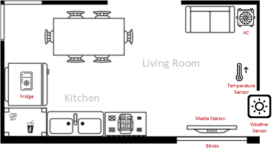

# Actor-based-Home-Automation
Hüseyin Arziman & Yusuf Cetinkaya

## General

In this lab exercise...

## Components:

## Air Condition

## Blind

## Media Station

## Fridge
In addition, it was part of the task to implement a fridge including its components. 
The `fridge` is a stand-alone actor that is independent of the smart home. 
It contains a `weight sensor` and a `storage sensor`, which were also implemented as actors. 
The fridge contains various products, each of which has a different weight. 
When the `fridge` receives an order, it spawns an `order` actor.
In addition, products that are in the fridge can be consumed through the user interface. 
Furthermore, the command **"fh"** (Fridge History) can be used to display an order history of the individual products. 
In order to illustrate the interaction of the entire actors more clearly, we will use the fridge as an example, we will simulate a process:  
1. After startup, the sensors and the fridge are created.  
2. When the **"fo"** (Fridge Order) command is entered in the CL, it is necessary to choose from a selection of products (cheese, tomato, salad, egg).  
3. After a product has been selected, it is sent to the `fridge` which spawns an `order` actor.  
4. The `order` actor first sends a message containing the product to the `weight sensor`, which checks whether the fridge has enough weight available considering the product to be ordered.
5. If this is the case, the `storage sensor` is receiving a message containing the product and as soon as it also reports that the fridge has enough space, the order is placed and the 
product is stored in the fridge. Otherwise the `storage sensor` will report, that the `fridge` has not enough storage.
6. A history entry is created and the `order` actor is stopped 

### Automatic Product Checking System
An automatic product checking system is active, which controls whether an item that has to be ordered. 
This works in such a way that the `fridge` sends a message to itself at predefined intervals in which it queries its contents. If the stock of an already 
ordered product is at zero the `fridge` creates an `order` actor.  
When a product is consumed, it is only checked whether this item is available. if so, the item is removed from the `fridge`.
